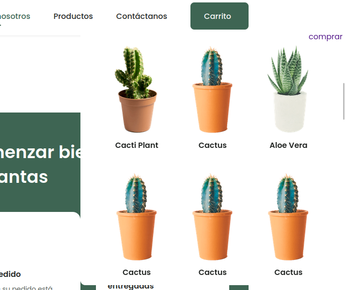
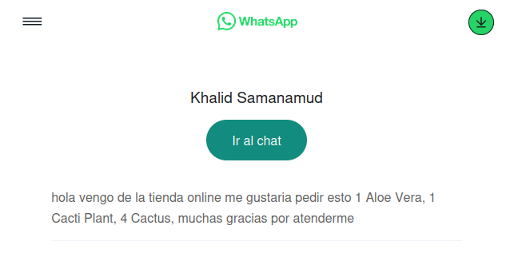

## Visualizar pagina https://elsemooo.github.io/decoplantas/

### Ejecuta el programa localmente

```bash
  git clone https://github.com/elsemooo/decoplantas.git
```

```bash
  cd decoplantas
```

### Abre index.html con liveserver o como lo harías normalmente

## Observaciones:

### Página con plantilla. Implemente un carrito de compras que te redirige a un chat de WhatsApp con el texto ya prescrito sobre los productos. ejem:

### carrito:



### Click a comprar

### Link de WhatsApp:



# esa es la funcion mas importante
